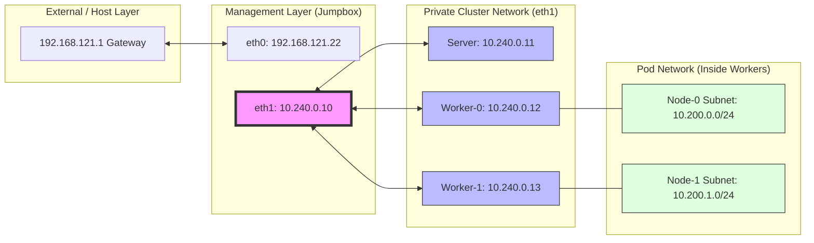

# Cluster Networking Mental Model 🗺️

This document visualizes the "Layered" relationship between your Host, the Jumpbox, the Cluster Management network, and the Pod network.

## The Architecture Diagram

## The Connectivity Layers

### 1. The Public/Host Entrance (`192.168.121.x`)
- **Primary Use**: SSH access from your host and internet downloads.
- **Role**: The "Exit" for the Jumpbox to fetch Kubernetes binaries.

### 2. The Management Corridor (`10.240.0.x`)
- **Primary Use**: Cluster orchestration (API traffic, Kubelet-to-API communication).
- **Scope**: Direct link (`scope link`) between Jumpbox, Server, and Workers.
- **Observation**: These machines can see each other's "Home IPs" directly on the `eth1` wire.

### 3. The Pod Island (`10.200.x.x`)
- **Primary Use**: Container-to-container communication.
- **The Challenge**: The Pod IPs are not part of the `eth1` physical network. They exist behind the Worker nodes.
- **The Goal of Module 11**: Tell the Linux Kernel on each node that for any packet addressed to `10.200.x.x`, it should use the corresponding Worker Node (`10.240.0.x`) as the **Next Hop** (Gateway).

---

## CKA Command Spotlight
To verify these layers in the exam:
1. `ip addr`: Check the physical interfaces (`eth0`, `eth1`).
2. `ip route`: Check the routing table (to see where packets are being sent).
3. `ping`: Test direct connectivity to node IPs.
