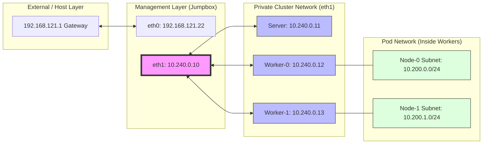

# Cluster Networking Mental Model 🗺️

This document visualizes the "Layered" relationship between your Host, the Jumpbox, the Cluster Management network, and the Pod network.

## The Architecture Diagram

```mermaid
graph LR
    subgraph "External / Host Layer"
    H[192.168.121.1 Gateway]
    end

    subgraph "Management Layer (Jumpbox)"
    J0[eth0: 192.168.121.22]
    J1[eth1: 10.240.0.10]
    end

    subgraph "Private Cluster Network (eth1)"
    S[Server: 10.240.0.11]
    W0[Worker-0: 10.240.0.12]
    W1[Worker-1: 10.240.0.13]
    end

    subgraph "Pod Network (Inside Workers)"
    P0["Node-0 Subnet: 10.200.0.0/24"]
    P1["Node-1 Subnet: 10.200.1.0/24"]
    end

    H <--> J0
    J1 <--> S
    J1 <--> W0
    J1 <--> W1
    W0 --- P0
    W1 --- P1

    style J1 fill:#f9f,stroke:#333,stroke-width:4px
    style S fill:#bbf,stroke:#333
    style W0 fill:#bbf,stroke:#333
    style W1 fill:#bbf,stroke:#333
    style P0 fill:#dfd,stroke:#333
    style P1 fill:#dfd,stroke:#333
```

## The Connectivity Layers

### 1. The Public/Host Entrance (`192.168.121.x`)
- **Primary Use**: SSH access from your host and internet downloads.
- **Role**: The "Exit" for the Jumpbox to fetch Kubernetes binaries.

### 2. The Management Corridor (`10.240.0.x`)
- **Primary Use**: Cluster orchestration (API traffic, Kubelet-to-API communication).
- **Scope**: Direct link (`scope link`) between Jumpbox, Server, and Workers.
- **Observation**: These machines can see each other's "Home IPs" directly on the `eth1` wire.

### 3. The Pod Island (`10.200.x.x`)
- **Primary Use**: Container-to-container communication.
- **The Challenge**: The Pod IPs are not part of the `eth1` physical network. They exist behind the Worker nodes.
- **The Goal of Module 11**: Tell the Linux Kernel on each node that for any packet addressed to `10.200.x.x`, it should use the corresponding Worker Node (`10.240.0.x`) as the **Next Hop** (Gateway).

---

## Inside the Node: The Intra-Node Plumbing 🛠️

The image below illustrates how a Pod's "Isolation" is actually achieved inside a Linux worker node.

### 1. Network Namespaces (`podns` vs `rootns`)
**Concept**: Linux Namespaces are the fundamental building blocks of containers. A "Network Namespace" provides a private copy of the network stack (interfaces, routing tables, firewall rules).
- **rootns**: The node's primary network space. It has the physical `eth0`/`eth1` interfaces.
- **podns**: A logical sandbox for the Pod. To the processes inside the Pod, it looks like they have their own dedicated network hardware.

### 2. The `pause` Container: The Network Anchor ⚓
**The Why**: In Kubernetes, all containers in a Pod share the same network stack. But what happens if the main container crashes and restarts? We don't want the IP address or network configuration to disappear.
- **Role**: The `pause` container (also called the "Sandbox" container) is the first to start. It "holds" the Network Namespace open. 
- **Benefit**: Other containers (like your app or a sidecar) then "join" this existing namespace. This allows them to talk to each other on `localhost`.

### 3. Veth Pairs & Bridges: The Virtual "Patch Cable" 🔌
**Concept**: Since the Pod is in a different namespace, it needs a way to talk to the node.
- **veth (Virtual Ethernet)**: These always come in pairs. Think of them as a virtual Ethernet cable with two ends. One end (`eth0`) sits inside the **podns**, and the other end sits in the **rootns**.
- **cbr0 (Bridge)**: In many setups, the `veth` ends in the root namespace are plugged into a virtual switch or bridge (`cbr0`). This allows multiple Pods on the same node to talk to each other locally.

### 4. CNI (Cilium): The Orchestrator 🐝
**Role**: The Container Network Interface (CNI) is the plugin that actually sets this up. When a Pod is created, the Kubelet calls Cilium to:
1. Create the `veth` pair.
2. Assign an IP address from the Pod CIDR (e.g., `10.200.x.x`).
3. Set up the routing rules so the rest of the cluster knows how to reach this IP.

---

> [!TIP]
> **Deep Dive: Cilium & eBPF**
> Modern CNIs like **Cilium** often bypass the traditional Linux bridge (`cbr0`) and IPTables entirely. They use **eBPF (Extended Berkeley Packet Filter)**—a technology that allows running code directly in the Linux Kernel. This makes networking significantly faster and more secure by routing packets at the lowest possible level without the overhead of the standard kernel networking stack.
>
> [Learn more about eBPF and Cilium](https://cilium.io/get-started/)

## CKA Command Spotlight
To verify these layers in the exam:
1. `ip addr`: Check the physical interfaces (`eth0`, `eth1`).
2. `ip route`: Check the routing table (to see where packets are being sent).
3. `ping`: Test direct connectivity to node IPs.
